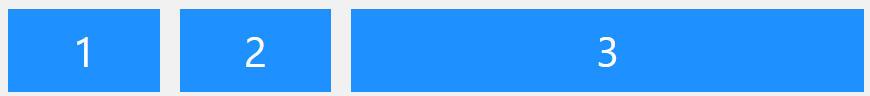

# Flexbox
## Flex container
### **Elemento padre *(contenedor)***


Representa (en este ejemplo) un **contenedor** con tres **elementos** flex.
<br/> El contenedor se vuelve flexible poniendo la propiedad de `display` a `flex`

```css
.flex-container {
  display: flex;
}
```

### **Propiedad de flex-direction**


Define en que direccion se van a apilar los elementos flex del contenedor.
>Ejemplo: El valor `column` apila los elementos flex verticalmente (descendiente)

```css
.flex-container {
  display: flex;
  flex-direction: column;
}
```
>Ejemplo: El valor `column-reverse` apila los elementos flex verticalmente (ascendiente)

```css
.flex-container {
  display: flex;
  flex-direction: column-reverse;
}
```

>Ejemplo: El valor `row` apila los elementos flex horizontalmente (izquierda a derecha)

```css
.flex-container {
  display: flex;
  flex-direction: row;
}
```

>Ejemplo: El valor `row-reverse` apila los elementos flex horizontalmente (derecha a izquierda)

```css
.flex-container {
  display: flex;
  flex-direction: row-reverse;
}
```

### **Propiedad de flex-wrap**


Define si los elementos flex deberian envolverse o no.
>Ejemplo: El valor `wrap` especifica que los elementos flex se envolveran si es necesario

```css
.flex-container {
  display: flex;
  flex-wrap: wrap;
}
```
>Ejemplo:El valor `nowrap` especifica que los elementos flex no se envolveran (*esto es por defecto*)

```css
.flex-container {
  display: flex;
  flex-wrap: nowrap;
}
```
>Ejemplo: El valor `wrap-reverse` especifica que los elementos flex se envolveran si es necesario, en reversa

```css
.flex-container {
  display: flex;
  flex-wrap: wrap-reverse;
}
```

### **Propiedad de flex-flow**
Es una nota en la propiedad para definir la `flex-direction` y el `flex-wrap`.

```css
.flex-container {
  display: flex;
  flex-flow: row wrap;
}
```

### **Propiedad de justify-content**

Usada para alinear los elementos flex

>Ejemplo: El valor `center` alinea los elementos flex al centro del contenedor

```css
.flex-container {
  display: flex;
  justify-content: center;
}
```

>Ejemplo: El valor `flex-start` alinea los elementos flex al inicio del contenedor

```css
.flex-container {
  display: flex;
  justify-content: flex-start;
}
```

>Ejemplo: El valor `flex-end` alinea los elementos flex al final del contenedor

```css
.flex-container {
  display: flex;
  justify-content: flex-end;
}
```

>Ejemplo: El valor `space-around` alinea los elementos flex con un espacio antes, entre y despues final de las lineas

```css
.flex-container {
  display: flex;
  justify-content: space-around;
}
```

>Ejemplo: El valor `space-between` alinea los elementos flex entre las lineas

```css
.flex-container {
  display: flex;
  justify-content: space-between;
}
```
### **Propiedad de align-items**

Usada para alinear los elementos flex

>Ejemplo: El valor `center` alinea los elementos flex al centro del contenedor

```css
.flex-container {
  display: flex;
  height: 200px;
  align-items: center;
}
```
>Ejemplo: El valor `flex-start` alinea los elementos flex en la parte superior del contenedor

```css
.flex-container {
  display: flex;
  height: 200px;
  align-items: flex-start;
}
```
>Ejemplo: El valor `flex-end` alinea los elementos flex en la parte inferior del contenedor

```css
.flex-container {
  display: flex;
  height: 200px;
  align-items: flex-end;
}
```

>Ejemplo: El valor `stretch` estira los elementos flex para llenar el contenedor (*esto es por defecto*)

```css
.flex-container {
  display: flex;
  height: 200px;
  align-items: stretch;
}
```

>Ejemplo: El valor `baseline` alinea los elementos flex por su linea base

```css
.flex-container {
  display: flex;
  height: 200px;
  align-items: baseline;
}
```
>El ejemplo usa diferentes tamaño de fuente para demostrar que los elementos se alinean por su linea base


### **Propiedad de align-content**

Usada para alinear las lineas flex

>Ejemplo: El valor `space-between` muestra las lineas flex con espacio igual entre elementos.

```css
.flex-container {
  display: flex;
  height: 600px;
  flex-wrap: wrap;
  align-content: space-between;
}
```
>Ejemplo: El valor `stretch` estira las lineas flex para abarcar el espacio sobrante (*esto es por defecto*).

```css
.flex-container {
  display: flex;
  height: 600px;
  flex-wrap: wrap;
  align-content: stretch;
}
```

>Ejemplo: El valor `center` meustra las lineas flex a la mitad del contenedor
```css
.flex-container {
  display: flex;
  height: 600px;
  flex-wrap: wrap;
  align-content: center;
}
```
>Ejemplo: El valor `flex-start` meustra las lineas flex al inicio del contenedor
```css
.flex-container {
  display: flex;
  height: 600px;
  flex-wrap: wrap;
  align-content: flex-start;
}
```
>Ejemplo: El valor `flex-end` meustra las lineas flex al final del contenedor
```css
.flex-container {
  display: flex;
  height: 600px;
  flex-wrap: wrap;
  align-content: flex-end;
}
```

## Flex items
### **Hijos**

Representa los hijos directos de un contenendor flex quienes automaticamente se convierten flexibles.

```css
<div class="flex-container">
  <div>1</div>
  <div>2</div>
  <div>3</div>
  <div>4</div>
</div>
```

### Propiedad **Orden**

El primer elemento flex del código no tiene que aparecer como el primer elemento del diseño.

El valor del orden debe ser un número, el valor predeterminado es 0.
>Ejemplo: La propiedad *orden* puede cambiar el orden de los elementos flex
```css
<div class="flex-container">
  <div style="order: 3">1</div>
  <div style="order: 2">2</div>
  <div style="order: 4">3</div>
  <div style="order: 1">4</div>
</div>
```
### Propiedad **flex grow**

La propiedad especifica cuanto crecera el flex relativo a los demas objetos flex. 
El valor debe ser un numero, predetirminado es 0.

>Ejemplo: Hace que el tercer elemento crezca 8 veces mas rapido que los demas elementos.
```css
<div class="flex-container">
  <div style="flex-grow: 1">1</div>
  <div style="flex-grow: 1">2</div>
  <div style="flex-grow: 8">3</div>
</div>
```

### Propiedad **flex shrink**

La propiedad especifica que tanto puede un objeto flex encogerse relativo a los demas objetos flex.
el valor debe ser un numero, el predeterminado es 1.

>Ejemplo: No deja que el tercer elemento encogerse tanto como los demas elementos.

```css
<div class="flex-container">
  <div>1</div>
  <div>2</div>
  <div style="flex-shrink: 0">3</div>
  <div>4</div>
  <div>5</div>
  <div>6</div>
  <div>7</div>
  <div>8</div>
  <div>9</div>
  <div>10</div>
</div>
```

### Propiedad **flex basis**

Define la longitud inicial de un elemento flex.

>Ejemplo: Define la longitud inicial del tercer elemento flex a 200 pixeles.
```css
<div class="flex-container">
  <div>1</div>
  <div>2</div>
  <div style="flex-basis: 200px">3</div>
  <div>4</div>
</div>
```

### Propiedad **align self**

Espicifica el alineado de un objeto seleccionado en el contenedor flexible.
<br/>La propiedad sobre escribe el alineado por defecto de la propiedad del contenedor.\

```css
<div class="flex-container">
  <div>1</div>
  <div>2</div>
  <div style="align-self: center">3</div>
  <div>4</div>
</div>
```
## Tablas
### Contenedor
| Propiedad| Descripcion |
| ----------- | ----------- |
| align-content | Modifica el comportamiento de la propiedad flex-wrap. Similar a align-items, pero en vez de alinear objetos flex, alinea lineas flex |
| align-items | Verticalmente alinea los elementos flex cuando no usan todo el espacio disponible en el cross-axis |
| display | Especifica el tipo de caja usada para un elemento HTML |
| flex-direction | Specifies the direction of the flexible items inside a flex container |
| flex-flow | Una nota de propiedad para la flex-direction y flex-wrap |
| flex-wrap | Especifica si los objetos flex se envolveran o no, si no hay suficiente espapcio para ellos en la linea flex |
| justify-content | Alinea horizontalmente los objetos flex cuando estos no usan todo el espacio entero en el main-axis |

### Items
| Propiedad | Descripcion |
| ----------- | ----------- |
| align-self | Especifica el lineamiento para un objeto flex (sobreesribe la propiedad align-items del contenedor flex) |
| flex | Una propiedad nota para el flex-grow, flex-shrink, y el flex-basis |
| flex-basis| Espicifica la longitud inicial de un objeto flex |
| flex-grow | Especifica cuanto crecera un objeto flex relativo a los demas objetos flex dentro del mismo contenedor |
| flex-shrink | Especifica cuanto se encogera un objeto flex relativo a los demas objetos flex en el mismo contenedor |
| order | Especifica el orden de los objetos flex dentro del mismo contenedor |
