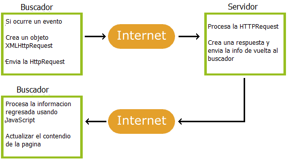

# Ajax
## Pagina HTML
```html
<!DOCTYPE html>
<html>
<body>

<div id="demo">
  <h2>Let AJAX change this text</h2>
  <button type="button" onclick="loadDoc()">Change Content</button>
</div>

</body>
</html>
```

La pagina HTML contiene una seccion `<div>` y un `<button>`.

La seccion `<div>` se usa para mostrar informacion de un server.

El `<button>` llama a una funcion (si se le da clic).

La funcion llama informacion de un servidor para mostrarla:

## Funcion loadDoc()
```js
function loadDoc() {
  var xhttp = new XMLHttpRequest();
  xhttp.onreadystatechange = function() {
    if (this.readyState == 4 && this.status == 200) {
     document.getElementById("demo").innerHTML = this.responseText;
    }
  };
  xhttp.open("GET", "ajax_info.txt", true);
  xhttp.send();
}
```

El archivo "ajax_info.txt" usada en el ejemplo de arriba, es un txt simple que se ve asi:
```html
<h1>AJAX</h1>
<p>AJAX is not a programming language.</p>
<p>AJAX is a technique for accessing web servers from a web page.</p>
<p>AJAX stands for Asynchronous JavaScript And XML.</p>
```
## Que es AJAX?
AJAX = Asynchronous JavaScript And XML.

AJAX no es un lenguaje de programacion

AJAX usa una combinacion de:

Una objeto ya incluido en el buscador de tipo XMLHttpRequest (para pedir datos de un servidor web) en JavaScript y HTML DOM (para mostrar o usar la informacion)

AJAX permite a las paginas web estat actualizadas asincronamente intercambiando informacion con el servidor web tras bambalinas. Esto significa que que es posible actualizar partes de una pagina web, sin tener que recargar en su totalidad toda la pagina.
## Como funciona AJAX


1. Un evento ocurre en una pagina web (la pagina es cargada, un boton es pulsado)
2. Un objeto XMLHttpRequest es creado por el JavaScript
3. El objeto XMLHttpRequest envia la peticion al servidor web
4. El servidor procesa la peticion
5. El servidor envia la respuesta de vuelta al buscador
6. La respuesta es leida por el JavaScript
7. Accion propia (como el actualizar de la pagina) es ejecutada por el JavaScript
